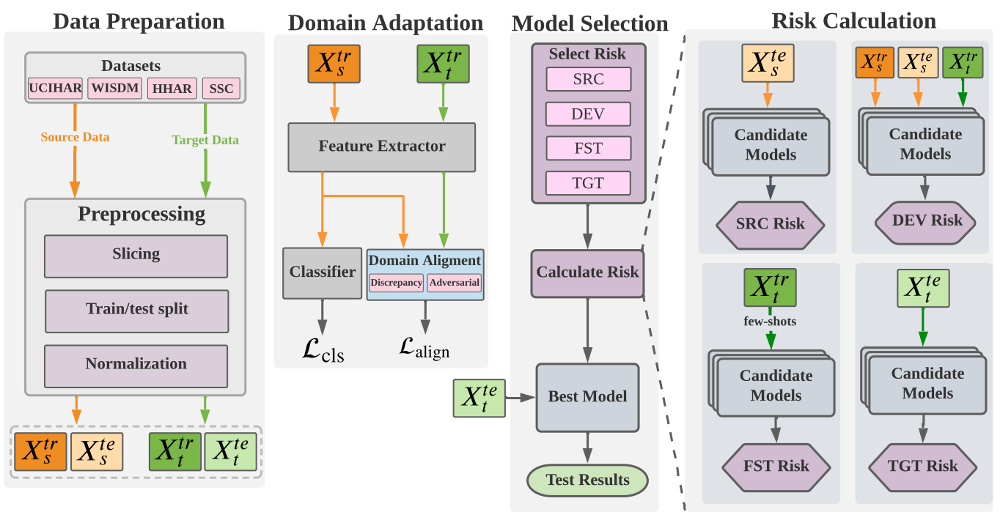

# AdaTime: A Systematic Evaluation of Domain Adaptation Algorithms on Time Series Data [[Paper](https://arxiv.org/abs/2203.08321)]
#### *by: Mohamed Ragab\*, Emadeldeen Eldele\*,  Wee Ling Tan, Chuan-Sheng Foo, Zhenghua Chen, Min Wu, Chee Kwoh, Xiaoli Li*

**AdaTime** is a PyTorch suite to systematically and fairly evaluate different domain adaptation methods on time series data.


# Disclaimer: This work is for research only and not for commercial use!


## Requirmenets:
- Python3
- Pytorch==1.7
- Numpy==1.20.1
- scikit-learn==0.24.1
- Pandas==1.2.4
- skorch==0.10.0 (For DEV risk calculations)
- openpyxl==3.0.7 (for classification reports)
- Wandb=0.12.7 (for sweeps)

## Datasets

### Available Datasets
We used four public datasets in this study. We also provide the **preprocessed** versions as follows:
- [Sleep-EDF](https://researchdata.ntu.edu.sg/dataset.xhtml?persistentId=doi:10.21979/N9/UD1IM9)
- [UCIHAR](https://researchdata.ntu.edu.sg/dataset.xhtml?persistentId=doi:10.21979/N9/0SYHTZ)
- [HHAR](https://researchdata.ntu.edu.sg/dataset.xhtml?persistentId=doi:10.21979/N9/OWDFXO)
- [WISDM](https://researchdata.ntu.edu.sg/dataset.xhtml?persistentId=doi:10.21979/N9/KJWE5B)

### Adding New Dataset

#### Structure of data
To add new dataset (*e.g.,* NewData), it should be placed in a folder named: NewData in the datasets directory.

Since "NewData" has several domains, each domain should be split into train/test splits with naming style as
"train_*x*.pt" and "test_*x*.pt".

The structure of data files should in dictionary form as follows:
`train.pt = {"samples": data, "labels: labels}`, and similarly for `test.pt`.

#### Configurations
Next, you have to add a class with the name NewData in the `configs/data_model_configs.py` file. 
You can find similar classes for existing datasets as guidelines. 
Also, you have to specify the cross-domain scenarios in `self.scenarios` variable.

Last, you have to add another class with the name NewData in the `configs/hparams.py` file to specify
the training parameters.


## Domain Adaptation Algorithms
### Existing Algorithms
- [Deep Coral](https://arxiv.org/abs/1607.01719)
- [MMDA](https://arxiv.org/abs/1901.00282)
- [DANN](https://arxiv.org/abs/1505.07818)
- [CDAN](https://arxiv.org/abs/1705.10667)
- [DIRT-T](https://arxiv.org/abs/1802.08735)
- [DSAN](https://ieeexplore.ieee.org/document/9085896)
- [HoMM](https://arxiv.org/pdf/1912.11976.pdf)
- [DDC](https://arxiv.org/abs/1412.3474)
- [CoDATS](https://arxiv.org/pdf/2005.10996.pdf)
- [AdvSKM](https://www.ijcai.org/proceedings/2021/0378.pdf)


### Adding New Algorithm
To add a new algorithm, place it in `algorithms/algorithms.py` file.


## Training procedure

The experiments are organised in a hierarchical way such that:
- Several experiments are collected under one directory assigned by `--experiment_description`.
- Each experiment could have different trials, each is specified by `--run_description`.
- For example, if we want to experiment different UDA methods with CNN backbone, we can assign
`--experiment_description CNN_backnones --run_description DANN` and `--experiment_description CNN_backnones --run_description DDC` and so on.

### Training a model

To train a model:

```
python main.py  --experiment_description exp1  \
                --run_description run_1 \
                --da_method DANN \
                --dataset HHAR \
                --backbone CNN \
                --num_runs 5 \
                --is_sweep False
```
### Launching a sweep
Sweeps here are deployed on [Wandb](https://wandb.ai/), which makes it easier for visualization, following the training progress, organizing sweeps, and collecting results.

```
python main.py  --experiment_description exp1_sweep  \
                --run_description sweep_over_lr \
                --da_method DANN \
                --dataset HHAR \
                --backbone CNN \
                --num_runs 5 \
                --is_sweep True \
                --num_sweeps 50 \
                --sweep_project_wandb TEST
```
Upon the run, you will find the running progress in the specified project page in wandb.

`Note:` If you got cuda out of memory error during testing, this is probably due to DEV risk calculations


### Upper and Lower bounds
To obtain the source-only or the target-only results, you can run `same_domain_trainer.py` file.

## Results
- Each run will have all the cross-domain scenarios results in the format `src_to_trg_run_x`, where `x`
is the run_id (you can have multiple runs by assigning `--num_runs` arg). 
- Under each directory, you will find the classification report, a log file, checkpoint, 
and the different risks scores.
- By the end of the all the runs, you will find the overall average and std results in the run directory.

## Contact
For any issues/questions regarding the paper or reproducing the results, please contact any of the following.   

Mohamed Ragab:  *mohamedr002{at}e.ntu.edu.sg*

Emadeldeen Eldele:   *emad0002{at}e.ntu.edu.sg*   

School of Computer Science and Engineering (SCSE),   
Nanyang Technological University (NTU), Singapore.   
